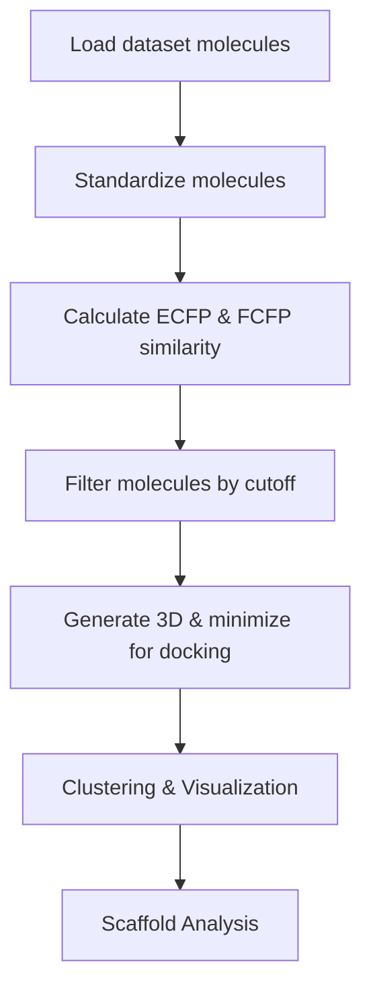

# Virtual Screening Pipeline for Cheminformatics (RDKit-based)

This project implements a modular and automated pipeline for virtual screening in small molecule informatics, using RDKit and machine learning-friendly cheminformatics workflows.

It provides tools for:
- Data processing (standardization)
- 2D similarity screening using ECFP & FCFP fingerprints
- Filtering based on similarity cutoff
- 3D conformer generation & minimization (ready for docking)
- Clustering & chemical space visualization
- Scaffold analysis for diversity assessment

This is an upgraded version of the previous project, 2D_similarity_search.py, now with:

Combined ECFP & FCFP similarity search

UMAP/t-SNE/PCA visualization

Butina clustering for chemical diversity

Command-line interface for full pipeline automation

To run pipeline: 

```markdown
python run_screening_pipeline.py -i molecules.sdf -r reference_molecules.sdf -o similar_molecules.sdf -c 0.90 -f rdkit
```

The pipeline workflow:

